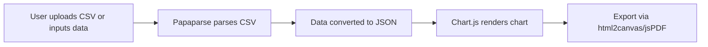

# Data Visualization Tool — Project Roadmap (Next.js Version)

## Product Requirements Document (PRD)

### Value Proposition
A lightweight web app that lets users upload or input their own simple data (e.g., workout logs, budgets, mood tracking) and instantly generate clean, interactive charts — all in the browser, with no backend required.

### Users
- Students tracking study habits or budgets  
- Fitness enthusiasts logging workouts  
- Anyone needing quick one-off visualizations without complex tools  

### MVP Features
1. **Data Input**: Upload CSV or enter data manually in a table.  
2. **Chart Generation**: Render interactive charts (bar, line, pie, scatter).  
3. **Export Options**: Download charts as PNG/SVG or PDF.  
4. **Customization**: Change chart type, colors, and axis labels.  

### Out of Scope
- User accounts or authentication  
- Persistent data storage (all session-based)  
- Advanced predictive analytics or AI insights  

### Non-Functional Requirements
- Must run fully in the browser with no backend.  
- Handle CSVs up to ~5MB gracefully.  
- Charts should render within 1 second for typical datasets (<5k rows).  

### Acceptance Criteria
- A user can upload a CSV and see at least 2 different chart options instantly.  
- A user can export any chart as an image or PDF.  
- App works consistently across modern browsers (Chrome, Firefox, Safari, Edge).  

### API Shapes
_No APIs required. All parsing and rendering done client-side._

### Data Model
- Internal representation of uploaded CSV as JSON.  
- Columns inferred as numeric, categorical, or date.  

### Edge Cases
- Empty CSV or malformed data.  
- Non-UTF8 characters in files.  
- Large datasets causing performance lag.  

---

## Technical Roadmap

### Overview
Deliver a simple, frontend-only data visualization tool demonstrating CSV parsing, chart rendering, and file export. Deployable on static hosting (Vercel/Netlify) with no backend.

### Tech Stack
- **Framework:** Next.js  
- **Visualization:** Chart.js (fallback: D3.js if needed)  
- **Styling:** Tailwind CSS  
- **File Parsing:** Papaparse  
- **Export:** html2canvas + jsPDF  
- **Deployment:** Vercel (primary) or Netlify  

### Local vs Deployment Environment
- **Local:** Run with `npm run dev`, mock CSVs for testing.  
- **Deployment:** Static build pushed to Vercel/Netlify (`next build && next export`).  

### Setup & Tooling
- Initialize project:  
  ```bash
  npx create-next-app data-viz-tool
  ```  
- Install dependencies:  
  ```bash
  npm install chart.js papaparse tailwindcss html2canvas jspdf
  ```  
- Configure TailwindCSS with Next.js.  
- Recommended tooling: ESLint + Prettier for consistency.  

### Architecture Overview


### Deployment Plan
1. Push repo to GitHub.  
2. Connect repo to Vercel.  
3. Test CSV uploads and downloads on live URL.  
4. Share link for Product Hunt launch.  

### Testing & Data
- Unit tests for parsing and chart rendering.  
- Manual tests with various CSV types (numeric, categorical, date-heavy).  

### README Plan
- Project overview  
- Features list  
- Tech stack  
- Local setup guide  
- Deployment instructions  
- Known limitations  

### Roadmap & Reflection
Future features to consider:  
- Persistent storage via IndexedDB or localStorage.  
- More advanced chart types (heatmaps, radar).  
- Drag-and-drop CSV upload.  
- Template themes for chart aesthetics.  

---

## Task List

### Milestone 1: Project Setup
- Initialize repo and Next.js project.  
- Configure Tailwind and linting tools.  

### Milestone 2: Core Functionality
- CSV upload and parsing.  
- Manual table input option.  

### Milestone 3: Visualization
- Basic chart rendering with Chart.js.  
- Dynamic switching between chart types.  

### Milestone 4: Export
- Export to PNG/SVG using html2canvas.  
- Export to PDF using jsPDF.  

### Milestone 5: Deployment & Documentation
- Deploy on Vercel.  
- Write README.  

---

## Definition of Done
- User can upload a CSV or enter data manually.  
- At least 2 chart types render correctly.  
- Chart can be exported as PNG or PDF.  
- App is deployed and live.  
- Documentation clearly explains usage.  
